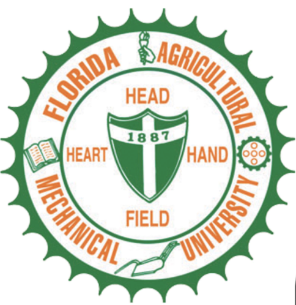

```{r setup, include=FALSE}
knitr::opts_chunk$set(echo = TRUE)
```



## Hands-On Research:  Data Science and Machine Learning Applications for Images and Behavior Analysis

### Models and Methods for Image and Text data with ML.


Why will it be interesting to have you enroll in this summer camp? Would you like to increase your knowledge and creativity using science, technology, mathematics, and you want to know the models used by the most prominent companies to track your interests. In this Hands-On Research for Undergraduates program, we will deliver the main concepts that combine statistical and computational theory to create and train AI (Machine Learning) models for classification and prediction problems in the field of image and Behavior analysis. Hands-On Research will take place on ------------- (8 weeks).    

The summer camp will provide experience in **formulating** and carrying out a tangible **data science analysis** with real-world data. The capstone will be a **group/team project (3/5 students)** and each project will focus in open, pre-existing secondary data.  

### Learning Objectives

* Students will be computing with data using popular language like *Python and R*, but also specific languages for transforming and manipulating text, and for managing complex computational pipelines.  

* One of the outcomes of the summer project will be to develop a **data science methodology workflow** and make them available for use in **future projects**. 

* The student will learn how to analyze and interpret geospatial images to classify the diverse types of vegetation presented in the image.

* Students will design and create a research paper using data science methodology. 

### Week 1: Intro to Python and R (Jun7-Jun11)

* [Zoom Link :] [https://famu.zoom.us/j/93938577076] 

### Week 2: Data Science tools (Jun14-Jun18)

* [Zoom Link :] [https://famu.zoom.us/j/93938577076] 

### Week 3: Intro to Statistics and Probability (Jun21-Jun25)

* [Zoom Link :] [https://famu.zoom.us/j/93938577076] 

### Week 4: Data Science for Research (tools for manage and share research papers) (Jun28-Jul2) 

* [Zoom Link :] [https://famu.zoom.us/j/93938577076] 

### Week 5: Intro to Machine Learning with Python (Jul5-Jul9) 

* [Zoom Link :] [https://famu.zoom.us/j/93938577076] 

### Week 6: Final Research Projects I (Jul12-Jul16)

* [Zoom Link :] [https://famu.zoom.us/j/93938577076] 

### Week 7: Final Research Projects II (Jul19-Jul23) 

* [Zoom Link :] [https://famu.zoom.us/j/93938577076] 

### Week 8: Research Presentation and Awards (Jul26-Jul30) 

* [Zoom Link :] [https://famu.zoom.us/j/93938577076]  


 

